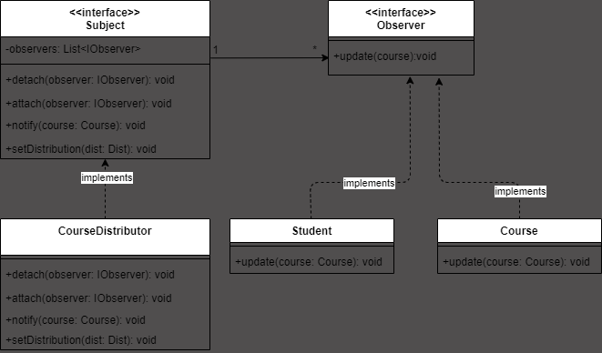

The Observer Pattern matches the requirements perfectly. This pattern decouples the subject (CourseDistributor) from its observers (Student, or other potential user classes). Observers can dynamically register, and the subject notifies them of changes.

