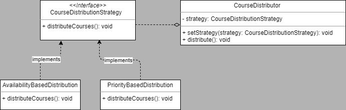

## Appropriate Design Pattern: Strategy Pattern

The Strategy Pattern is a perfect fit for this problem. It allows you to define a family of algorithms (in this case, course distribution paradigms) and makes them interchangeable. The strategy pattern enables you to:

- Dynamically select a specific course distribution paradigm (e.g., "availability-based" or "priority-based").
- Add new paradigms in the future without modifying existing code.

### Key Components of the Strategy Pattern

- **Strategy Interface**:
    - Defines a common interface for all distribution paradigms.
    - Each paradigm implements this interface.

- **Concrete Strategies**:
    - Specific implementations of the strategy interface (e.g., `AvailabilityBasedDistribution`, `PriorityBasedDistribution`).

- **Context Class**:
    - Maintains a reference to a Strategy object.
    - Delegates course distribution tasks to the selected strategy.

### Proposed Design

1. **Classes and Interfaces**

     - `CourseDistributionStrategy` (Strategy Interface): Declares a method `distributeCourses()`.
     - **Concrete Strategies**:
         - `AvailabilityBasedDistribution`: Implements distribution based on availability.
         - `PriorityBasedDistribution`: Implements distribution based on priorities.
     - `CourseDistributor` (Context):
         - Maintains a reference to a `CourseDistributionStrategy`.
         - Allows lecturers to dynamically change the strategy via a setter method (`setStrategy`).
         - Delegates the `distributeCourses()` task to the current strategy.

1. **UML Class Diagram**
